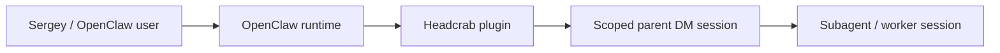
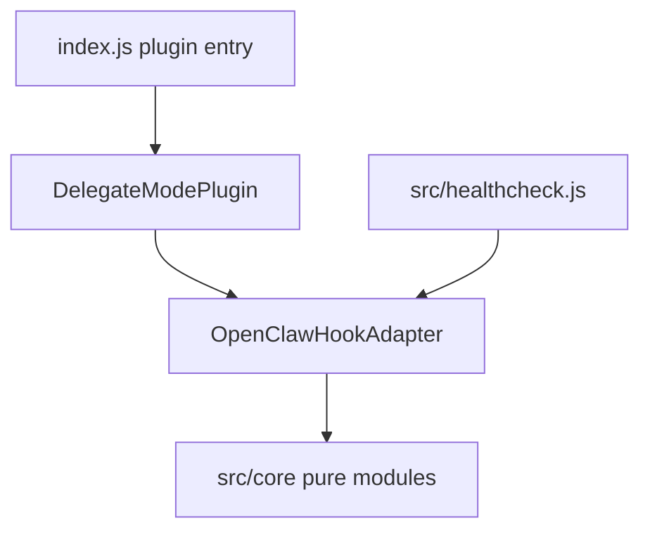

# Headcrab Architecture

Headcrab is an OpenClaw plugin: a small middleware layer that nudges scoped direct-message parent sessions toward worker-first delegation.

## Selected architecture decision

Headcrab uses a **functional core + OpenClaw plugin shell** architecture.

This is intentionally smaller than Clean Architecture or DDD. The product has two runtime seams and a compact domain, so the useful boundary is:

- pure core modules for scope, reminder rendering, and task wrapping;
- a thin OpenClaw hook adapter for runtime translation and sanitized logging;
- a plugin entrypoint that registers hooks and normalizes config.

## C4 view

### Context



Headcrab does not create agents or execute worker work. It only adds a transient reminder and rewrites the Headcrab-scoped `sessions_spawn` call before OpenClaw dispatches the spawn: `params.task` may be wrapped once and `params.runTimeoutSeconds` is normalized/capped for that spawn only.

### Container



### Module

```text
OpenClaw runtime
  -> index.js
    -> src/delegate-mode-plugin.js
      -> src/openclaw-hook-adapter.js
        -> src/core/scope-resolver.js
        -> src/core/delegate-reminder-renderer.js
        -> src/core/spawn-task-transformer.js
          -> src/core/task-sandwich-builder.js
        -> src/constants.js
```

## Dependency direction

Dependencies point inward toward pure logic:

- `index.js` imports the plugin shell and exports public modules.
- `src/delegate-mode-plugin.js` owns registration and config normalization.
- `src/openclaw-hook-adapter.js` owns OpenClaw hook translation and runtime logging.
- `src/core/*` imports only constants or Node standard-library utilities; it must not import OpenClaw SDK/runtime APIs.
- Tests and healthcheck may exercise shell and core, but production core remains logger-free and SDK-free.

## Plugin boundaries

Headcrab registers only:

- `before_prompt_build`: returns one transient delegate reminder block for scoped parent direct-message sessions.
- `before_tool_call`: rewrites only Headcrab-scoped `sessions_spawn` params for scoped parent direct-message sessions.
  - `params.task` is wrapped once with the task sandwich when it is not already sandwiched.
  - `params.runTimeoutSeconds` is normalized for that same spawn only: missing, invalid, non-finite, `0`, negative, or other non-positive values become `1800`; values above `1800` are capped to `1800`; explicit positive values below `1800` are preserved.
  - Already-sandwiched tasks are not rewrapped, but their `runTimeoutSeconds` value is still normalized/capped.

It does **not**:

- block tools;
- rewrite user messages;
- persist session state;
- schedule jobs;
- make network calls;
- enforce delegation outside the registered hooks.

## Configuration and fail-closed behavior

Default effective config is:

```json
{
  "scope": ["dm:*"],
  "features": {
    "promptReminder": true,
    "taskWrapping": true,
    "forthrightCommunication": true
  }
}
```

The top-level OpenClaw plugin `enabled` flag is the only global on/off switch. Plugin-local config accepts only `scope` and `features`. Invalid config fails closed by producing inactive scope and disabled features; it must never widen activation by guessing.

## Privacy and telemetry contract

Headcrab has no telemetry pipeline. Runtime observability is limited to optional, best-effort `api.logger` calls at the adapter boundary.

Allowed log data is coarse lifecycle metadata only: plugin code, monotonic adapter counter, hook, stage, outcome, reason, and optional wrapping variant.

Forbidden log data includes prompts, tasks, user messages, rewritten text, raw hook params, raw config, session keys, direct ids, chat/user/message ids, secrets, paths, `Error.message`, stacks, causes, or serialized exceptions.

Logger absence, partial logger implementations, or logger exceptions must never change hook return/throw behavior.

## Healthcheck role

`src/healthcheck.js` is an operator smoke test for the privacy and behavior contract. It uses synthetic session context and synthetic tasks only, verifies bounded reminder/wrapper output, checks duplicate wrapping behavior, and ensures emitted log payloads stay bounded and sanitized.

The healthcheck must not print raw prompts, raw tasks, session ids, config payloads, paths, secrets, hook payloads, or stack traces.

## Local context docs

- [`src/CONTEXT.md`](./src/CONTEXT.md) — source container purpose, boundaries, and migration notes.
- [`src/core/CONTEXT.md`](./src/core/CONTEXT.md) — pure core module contract and dependency rules.
